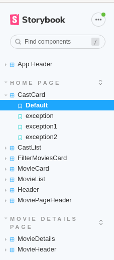

# Assignment 1 - ReactJS app.

Name: Niall Crowe

## Overview.

React movies app assignment for Web App Development 2 which displays info on movies similar to IMDB.

### Features.
 
+ Upcoming movies page
+ Similar movies page
+ Top-rated movies page
+ Now Playing movies page
+ Popular movies page
+ Filter and sort movies by genre. 

## Setup requirements.

Clone the repository onto your local machine. In the cloned repository, run `npm install`. If an error occurs, try `npm install --force`. 
In the root of the repository create an environment file called `.env`.
In this file enter your TMDB API key in this format `REACT_APP_TMDB_KEY=<yourTMDBAPIkey>`. 
If you do not have a TMDB API key, request one here: https://www.themoviedb.org/.
In the local command prompt/terminal, use the command `npm start` while in the cloned repository.

## API endpoints. 

+ Upcoming Movies = /movie/upcoming
+ Popular Movies = /movie/popular
+ Top Rated Movies = /movie/top_rated
+ Similar Movies = /movie/{movie_id}/similar
+ Movie Credits = /movie/{movie_id}/credits

## App Design.

### Component catalogue.

### UI Design.

***Upcoming Movies Page***

>Shows upcoming or soon to be releases movies. Click on the playlist icon to add to your watchlist.

***Watchlist Page***

>Shows movies you have added to your watchlist.

***Now Playing Page***

>Shows movies that are currnetly playing in theatres. Click on the playlist icon to add to your watchlist.

***Top Rated Page***

>Shows the highest rated films from TMDB. Click on the heart icon to add to your list of favorites.

***Popular Movies Page***

>Shows movies that are currently popular. Click on the heart icon to add to your list of favorites.

***Similar Movies Page***

>Shows similar movies to the movie you're currently looking at. View similar movies by going onto a movie's details page and clicking the `Similar Movies` button.

***Cast Members Page***

>Shows the cast members for a movie along with which character they played. View a movie's cast by going onto its details page and clicking the `Cast Members` button.

### Routing.

+ /movies/upcoming = Displays upcoming movies.
+ /movies/watchlist = Displays movies added to watchlist.
+ /movies/nowplaying = Displays movies that are currenty playing.
+ /movies/toprated = Displays highest rated movies from TMDB.
+ /movies/popular = Displays currently popular movies.
+ /movies/:id/similar = Displays movies similar movies to the selected movies.
+ /movies/:id/castmembers = Displays cast members of a movie.
